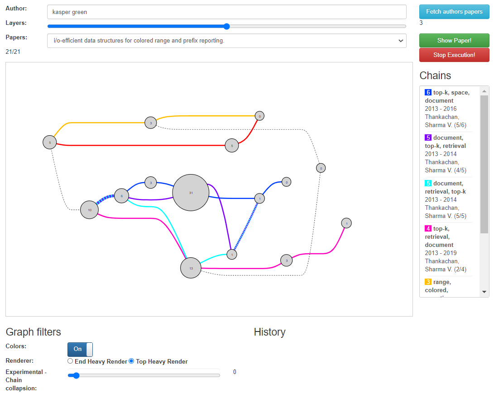

# Scientific Paper Citation Graph Visualization (SciPaCGVis)
Project for Data Visualization (2020 fall) course at Aarhus University (Lecturer: Hans-Jörg Schultz)

The paper uses the DBLP and OpenCitations APIs to construct a visual representation of how scientific papers in the field of Computer Science cite each other.

## Screenshots
Loaded paper by Kasper Green Larsen

