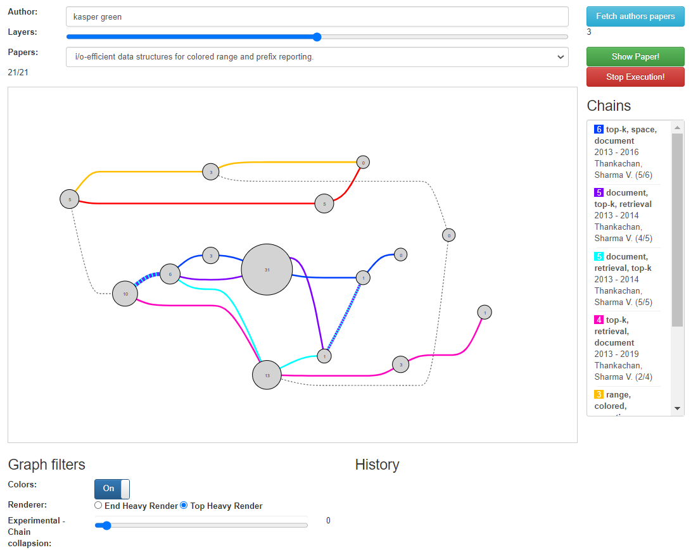

# SciPaWiz: A Tool For Explorative Visualization of Scientific Citation Networks
Project for Data Visualization (2020 fall) course at Aarhus University (Lecturer: Hans-Jörg Schulz)

The project uses the DBLP and OpenCitations APIs to construct a visual representation of how scientific papers in the field of Computer Science cite each other.

## Demos
The project can be demoed at [kristofferstrube.github.io/SciPaWiz](https://kristofferstrube.github.io/SciPaWiz/) but it is also dependent on external APIs.
The tool is a proof-of-concept. It is recommended to load papers with less than 100 citations due to slow spaghetti code.

Through the power of LLMs a second version with updated citation fetching and a few extra features can be demoed here [https://koenkalle.github.io/VibePaWiz/](https://koenkalle.github.io/VibePaWiz/).
The source of this fork can be found at [https://github.com/Koenkalle/VibePaWiz](https://github.com/Koenkalle/VibePaWiz). 

## Screenshots
Loaded paper by Kasper Green Larsen

## Maintainers
The project is constructed and maintained by:
 - [@MARATIVE](https://github.com/MARATVE)
 - [@Koenkalle](https://github.com/Koenkalle)
 - [@KristofferStrube](https://github.com/KristofferStrube)
